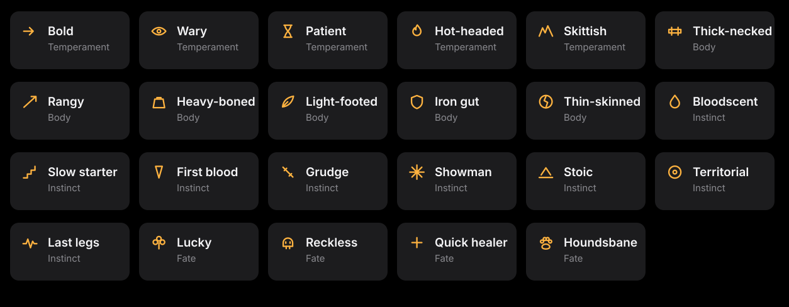

<p align="center">
  
</p>

<p align="center">
  
  
  
  
</p>

---

## You don't control the lion

You build it. Then you let go.

Lion Sim is a fighting game where you never touch the fighter. You choose a frame, a weapon, two abilities and a mind — and the lion takes it from there. It holds the range its weapon wants, reads incoming shots and steps off the line, spends its cooldowns when they matter, and wins or dies on its own judgement.

You're the owner, not the driver.

**Download either file and open it in a browser.** No install, no server, no internet.

| File | What it is |
|---|---|
| `lion-simulator.html` | The game. Every mode, every fight. |
| `lion-designer.html` | A standalone workshop for building one lion and exporting it. |

---

## Building a lion

<p align="center">
  
</p>

### Frame — what you're really choosing is tempo

Health barely moves across the size range. Speed and swing rate do the work.

| Frame | Health | Speed | Swing rate |
|---|---|---|---|
| Cub | 103 | 185 | 1.27× |
| Lean | 112 | 160 | 1.12× |
| Prime | 120 | 138 | 1.00× |
| Heavy | 131 | 119 | 0.88× |
| Titan | 142 | 99 | 0.77× |

A titan hits harder but swings slower, so damage per second lands within a couple of points of a cub's. A cub throws three blows while a titan winds up one — and the titan's one hurts.

### Weapons have weight

Fourteen of them across melee, ranged, magic and unique. Each carries a movement modifier, because at equal speed kiting would be unbeatable.

| | Reach | Moves at |
|---|---|---|
| Claws | 42 | **1.16×** |
| Spear | 82 | 1.08× |
| Great Maul | 58 | 1.04× |
| Hunting Bow | 300 | 0.90× |
| Fireball | 285 | 0.90× |
| Sunbeam | 320 | **0.86×** |

Range costs you your legs. Closing the gap is possible because of it.

### Abilities, armour and mind

Two abilities from twelve — Dash, Blink, Roar, Mend, Aegis, Frenzy, Vanish, Call Cub, plus the passives Siphon, Thornhide, Regrowth and Last Stand.

Four armours trading damage reduction against speed and swing rate.

Five minds that change how it thinks, not how hard it hits:

**Berserker** closes and never opens the gap · **Duelist** holds range and trades on its own terms · **Kiter** backs away and punishes the approach · **Trickster** fights around cover · **Adaptive** reads the matchup and changes plan mid-fight.

---

## Nature

<p align="center">
  
</p>

Every lion is born with **two of twenty-three traits**, and they never change. Some bend how it thinks. Some are physical. Some only fire in a particular moment — *Bloodscent* finishes wounded animals, *Grudge* grows angrier with every scar it carries, *Showman* swings faster while the crowd is up, *Houndsbane* was built for the pack.

Two of them touch your career directly. **Lucky** drops the death chance on a lost bout from 20% to 12%. **Reckless** raises it to 30% and pays you damage for the risk.

Opposites never land on the same lion.

### IV — the small edge

A number from 1 to 10, rolled at birth, shifting health and damage by about two percent either way. Between neighbouring numbers it's noise. A 10 against a 1 wins roughly seven times in ten. A better loadout beats a better IV every time.

### Cosmetics

Coat (8), mane (6) and tail (6) are free to change and cost nothing. Scars are not cosmetic — they're earned.

---

## The modes

<p align="center">
  
</p>

### Duel
Two lions, best of three, both at full health every round. Build them, roll them, or paste a lion code. Then watch.

### Lion — the career
A lion arrives rolled by chance. You may change **exactly two things** about it. Coat and mane are free; nature and IV are untouchable. Once it enters a championship, nothing changes again.

A championship is five bouts against five different lions. Win all five and it takes a belt and a **medallion** — one random perk, deliberately small, stacking across belts.

**Lose a bout and there's a one-in-five chance it dies there.** Four times in five it's dragged out alive, carrying a permanent scar you'll see on it from then on. The fifth time it's gone for good and its record goes on the wall.

### Challenges
**The pack** — waves of dogs and hyenas until you go down. **The Lion King** — one fight against a titan in black plate with red eyes and 484 health against your 125. Bring up to two other lions along for either.

Nothing here touches your record.

### Sanctuary
Somewhere for your lion to simply exist between championships. It wanders, stops, looks around. Tap near it and it bolts. There's a stone monument in the corner.

---

## Lion codes

Every lion compresses to a line of text carrying its build, nature, coat, mane, tail, IV, scars, medallions and record.

```
LION1-R29sZG1hbmV8NHwyfDN8MTEuNXwzfDAuMnwyLjExLjE0fDF8N3wxfDEyODQuNjE3fDEyLjE4
```

Copy it, save it as a `.txt`, send it to someone. Paste it into a duel slot, bring it into a challenge as an ally, or open it in Lion Designer. A career lion exported this way arrives with its belts and scars intact.

---

## How the balance was made

Every number in this game was measured, not guessed. The simulation core runs headless, and a tuner plays thousands of fights and nudges each value toward an even win rate.

| System | Before | After |
|---|---|---|
| Weapons | 91-point spread | **16** |
| Abilities | 89 | 17 |
| Builds | 92 | 11 |
| Armours | 100 | 7 |
| Minds | 53 | 8 |

Sunbeam went from a 98% win rate to 48%. Chain Hook went from 7% to 50%.

Two structural fixes mattered more than any number: weapons carry weight, and telegraphed attacks barely track — a charging lion turns at 0.55 rad/s, so sprinting sideways genuinely breaks the lock.

---

## Under the hood

No frameworks, no build step, no package manager. One HTML file with a canvas, hand-written vector art, and a Web Audio synth for every sound. Lions are drawn procedurally — the mane, tail, scars and coat you pick are the same code that draws them in the arena, in the preview cards, and in the icons.

The crowd is 144 individual lions with their own coats, manes, tails and sizes, sitting on two terraces, reacting by proximity to whatever just happened.

---

<p align="center">
  
</p>

<p align="center">
  <sub>There is one name you should not give a lion.</sub>
</p>
