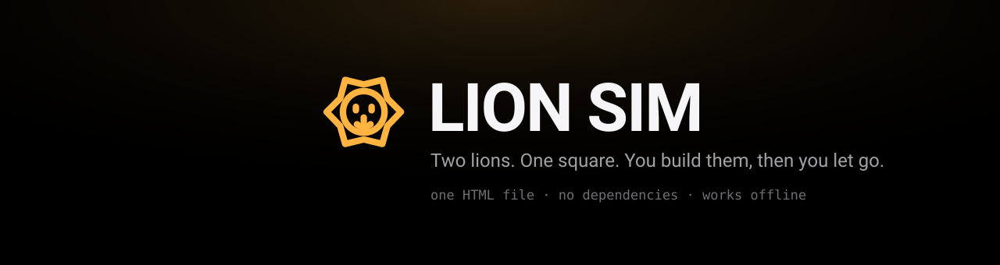
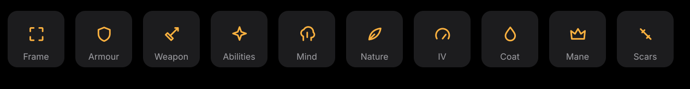
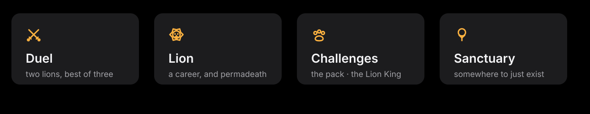
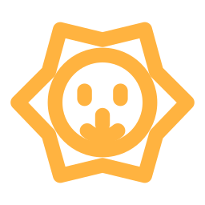

<p align="center">
  
</p>

<p align="center">
  
  
  
</p>

---

## You don't control the lion

You build it. Then you watch.

Lion Sim is an arena fighting game where the lions fight on their own. You pick the frame, the weapon, the abilities and the mind. Once the gate opens, it's all them. They chase, kite, dodge and hit their big moves when it counts, and they win or lose on their own.

You're the owner, not the player.

**Download `lion-simulator.html` and open it in any browser.** That's it. It works on your phone too, and you can add it to your home screen.

---

## Build a lion

<p align="center">
  
</p>

- **Frame.** Tiny cubs are fast and fragile. Titans are slow and hit like a truck.
- **Weapon.** 14 of them, from claws and spears to bows, fireballs and a Sunbeam. Long reach slows you down.
- **Abilities.** Pick two: dash, blink, roar, heal, shield, frenzy, go invisible, call a cub, and more.
- **Mind.** Berserker, Duelist, Kiter, Trickster or Adaptive. It changes how the lion fights, not how hard it hits.
- **Personality.** Every lion carries two of 23 traits. *Grudge* gets angrier with every scar. *Showman* fights better when the crowd is loud. *Lucky* cheats death more often.
- **Looks.** 12 coats, 8 manes, 8 tails. Pure style.

Hit **Roll** anywhere to get a random lion in one tap.

---

## Modes

<p align="center">
  
</p>

### ⚔️ Duel
Two lions, best of three. Build both, roll both, or paste in a friend's lion and settle it.

Switch to **2v2** for tag-team fights: two teams of two, and a round only ends when both lions on one side are down. Teammates never hit each other.

### 🏆 Championship
Build your own lion and send it through five-fight championships. Win all five and it earns a **gold belt** and a medallion that makes it a little stronger. Once it's yours, it's locked in. No tweaks.

Losing hurts. Every loss it survives leaves a **scar** you'll see on it forever. And every time it loses, there's a **1 in 5 chance it dies**. Then it goes up on the Hall of Fame and you start again.

Win a belt and the last opponent of every championship after that is a belt holder too.

Every win earns your lion **gold**, and so does every wave of the pack it survives. Spend it in the **Lion Store**, run by a red lion in a gold monocle: a new coat, a potion that rerolls one personality trait, or a whole new weapon. The gold belongs to that lion. When it's gone, so is the money.

### 🐾 Challenges
**The pack.** Survive wave after wave of dogs and hyenas.
**The Lion King.** One fight against a giant in black armour with red eyes.
**The Ancient Lion.** A navy-and-gold colossus, half as big again as a titan. Get close and it blasts you with a gold nova. Stay back and it drops stars on you.
**Old Lion.** Your tutor, out of retirement for one last fight. Beat him if you can... and if you can live with it.

Bring up to two friends to any of them.

### 🥇 Tournament
Eight lions, one bracket. Quarter-finals, semis, final, and every match is best of three. Edit any lion, roll them all, shuffle the draw and watch one come out on top.

---

## Lion codes

Every lion fits into one line of text:

```
LION1-R29sZG1hbmV8NHwyfDN8MTEuNXwzfDAuMnwyLjExLjE0fDF8N3wxfDEyODQuNjE3fDEyLjE4
```

Copy it, save it as a `.txt`, send it to a mate. It carries everything: the build, the looks, the scars and the belts. Paste a champion into a duel and the game asks whether it keeps its medallions or comes in fresh.

Belts can only be won. The Editor always loads lions without them.

---

## Little things

- A crowd of lions fills the stands and reacts to every big hit.
- An original soundtrack, all generated live: a brooding pre-battle theme while your lion waits at the gate, war drums in the fights, something heavier for the bosses... and one very sad song. Tap the speaker to cycle sound + music, sound only, or off.
- Every lion is drawn live, so scars, belts, manes and tails show up everywhere, including in the fights.
- Open any lion's **Summary** to get its **lion card**: a trading-card picture with the lion, its badges, traits, stats, loadout and record. Copy it, save it or share it straight to your friends.
- There's a free **Editor** (top left) for building anything you want, just for fun.
- New here? Tap **?** and Old Lion will walk you through everything. He's been around a while.
- Your progress saves in the browser, so your lion, gold and tournament are still there next time.

---

<p align="center">
  
</p>

<p align="center">
  <sub>There is one name you should not give a lion.</sub>
</p>
